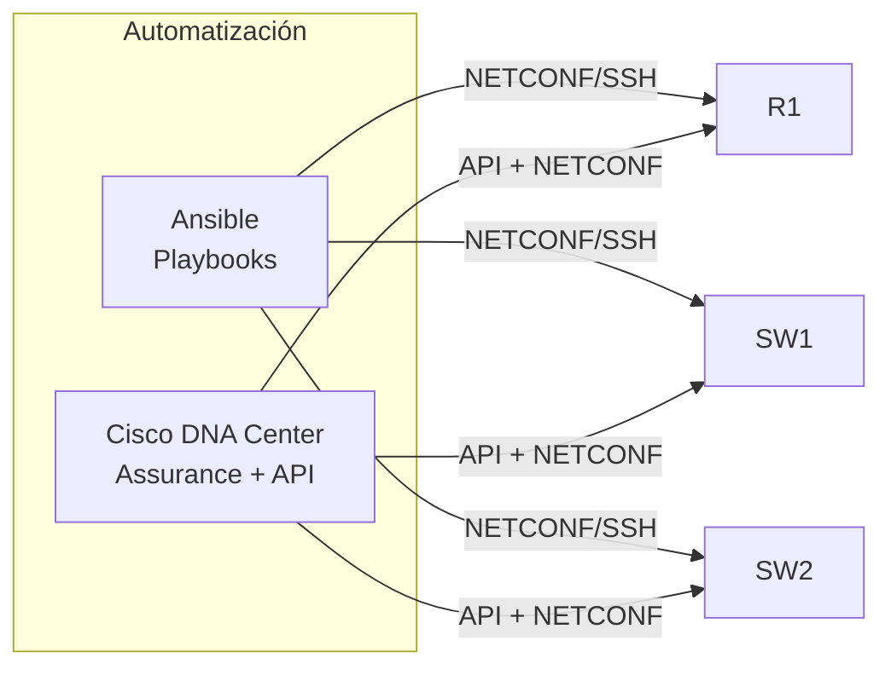

Novena y última parte de la serie. La red del edificio es completa: funcional,
redundante, segura, inalámbrica, con servicios IP, QoS, monitoreo y
virtualización. Ahora la **automatizas** con Ansible para ejecutar cambios
a escala y exploras **Cisco DNA Center** como plataforma de gestión.



## Requisitos

- Red completa del [ejercicio anterior](../10-network-virtualization/exercise).
- Ansible instalado en una estación de trabajo Linux.
- Acceso a Cisco DNA Center (puede ser sandbox de Cisco DevNet).

## Objetivos

1. Configurar **Ansible** con inventory y playbooks para la red del edificio.
2. Ejecutar un playbook que configure **VLANs y QoS** en todos los switches.
3. Hacer **backup de configuraciones** con Ansible.
4. Explorar **Cisco DNA Center** (dashboard, assurance, APIs).
5. Documentar el proceso de automatización.

## Pasos

### 1. Instalar Ansible y módulos de red

```bash
# Instalar Ansible
pip install ansible

# Instalar módulos de red Cisco
ansible-galaxy collection install cisco.ios
```

### 2. Crear el inventory

```yaml
# inventory.yml
all:
  children:
    switches:
      hosts:
        SW1:
          ansible_host: 192.168.99.10
          ansible_user: admin
          ansible_password: "{{ vault_sw1_pass }}"
          ansible_network_os: cisco.ios.ios
          ansible_connection: ansible.netcommon.network_cli
        SW2:
          ansible_host: 192.168.99.11
          ansible_user: admin
          ansible_password: "{{ vault_sw2_pass }}"
          ansible_network_os: cisco.ios.ios
          ansible_connection: ansible.netcommon.network_cli
        SW3:
          ansible_host: 192.168.99.12
          ansible_user: admin
          ansible_password: "{{ vault_sw3_pass }}"
          ansible_network_os: cisco.ios.ios
          ansible_connection: ansible.netcommon.network_cli
    routers:
      hosts:
        R1:
          ansible_host: 192.168.99.1
          ansible_user: admin
          ansible_password: "{{ vault_r1_pass }}"
          ansible_network_os: cisco.ios.ios
          ansible_connection: ansible.netcommon.network_cli
```

### 3. Playbook de VLANs

```yaml
# playbooks/configurar-vlans.yml
---
- name: Configurar VLANs en switches
  hosts: switches
  gather_facts: no
  tasks:
    - name: Crear VLAN 10 - Datos
      cisco.ios.ios_vlans:
        config:
          - vlan_id: 10
            name: Datos
            state: active
        state: merged

    - name: Crear VLAN 20 - Voz
      cisco.ios.ios_vlans:
        config:
          - vlan_id: 20
            name: Voz
            state: active
        state: merged

    - name: Crear VLAN 30 - WiFi
      cisco.ios.ios_vlans:
        config:
          - vlan_id: 30
            name: WiFi
            state: active
        state: merged

    - name: Crear VLAN 99 - Gestion
      cisco.ios.ios_vlans:
        config:
          - vlan_id: 99
            name: Gestion
            state: active
        state: merged
```

### 4. Ejecutar el playbook

```bash
# Dry run (sin cambios reales)
ansible-playbook -i inventory.yml playbooks/configurar-vlans.yml --check --diff

# Ejecutar
ansible-playbook -i inventory.yml playbooks/configurar-vlans.yml
```

### 5. Playbook de backup

```yaml
# playbooks/backup-configs.yml
---
- name: Backup configuraciones
  hosts: all
  gather_facts: no
  tasks:
    - name: Obtener running-config
      cisco.ios.ios_command:
        commands:
          - show running-config
      register: config_output

    - name: Guardar en archivo
      copy:
        content: "{{ config_output.stdout[0] }}"
        dest: "backups/{{ inventory_hostname }}-{{ ansible_date_time.date }}.cfg"
      delegate_to: localhost
```

```bash
ansible-playbook -i inventory.yml playbooks/backup-configs.yml
```

### 6. Explorar Cisco DNA Center

Accede al sandbox de Cisco DevNet:
`https://sandboxdnac.cisco.com`

#### Dashboard

- Ver **Health Score** de dispositivos.
- Revisar **Issues** activos.
- Explorar **Client 360**.

#### Assurance

- Navegar a **Health → Network**.
- Verificar estado de dispositivos.
- Explorar **Application Visibility**.

#### APIs

Explorar la documentación de APIs:

```bash
# Token
TOKEN=$(curl -s -k -X POST \
  https://sandboxdnac.cisco.com/api/system/v1/auth/token \
  -u devnetuser:Cisco123! | jq -r '.token')

# Listar dispositivos
curl -s -k -X GET \
  https://sandboxdnac.cisco.com/api/v1/network-device \
  -H "X-Auth-Token: $TOKEN" | jq '.response[] | {hostname, ipAddress}'
```

### 7. Playbook de verificación

```yaml
# playbooks/verificar-red.yml
---
- name: Verificar estado de la red
  hosts: all
  gather_facts: no
  tasks:
    - name: Verificar interfaces up
      cisco.ios.ios_command:
        commands:
          - show ip interface brief
      register: interfaces

    - name: Verificar VLANs
      cisco.ios.ios_command:
        commands:
          - show vlan brief
      register: vlans
      when: "'switches' in group_names"

    - name: Verificar QoS (solo routers)
      cisco.ios.ios_command:
        commands:
          - show policy-map interface
      register: qos
      when: "'routers' in group_names"

    - name: Mostrar resultados
      debug:
        msg: "{{ inventory_hostname }}: Interfaces OK"
```

### 8. Verificación final

```bash
# Verificar Ansible puede conectar
ansible all -i inventory.yml -m ping

# Ejecutar verificación
ansible-playbook -i inventory.yml playbooks/verificar-red.yml

# Ver backups
ls backups/
```

## Resultado esperado

Al completar este ejercicio:
- Ansible configura **VLANs** en todos los switches con un solo comando.
- Las configuraciones se **backup** automáticamente.
- Cisco DNA Center muestra **assurance** de la red completa.
- La red del edificio está **automatizada** y lista para operación.

## Fin de la serie

Con esta parte final, has construido una red completa de edificio de un piso:

| Parte | Módulo | Tema |
| :---- | :----- | :--- |
| 1 | Device Management | Configuración básica |
| 2 | Network Config | VLANs, routing |
| 3 | Redundancia | STP, EtherChannel, HSRP |
| 4 | Seguridad | Port Security, ACLs |
| 5 | Wireless | APs, WLC, WPA2 |
| 6 | IP Services | NAT, DHCP, DNS |
| 7 | QoS & Design | QoS, documentación |
| 8 | Management | SNMP, Syslog, troubleshooting |
| 9 | Virtualization | VRF, GRE |
| 10 | Automation | Ansible, DNA Center |

Si dominas todos los módulos y completas los ejercicios, tienes una base sólida
para los objetivos del examen CCNA.
