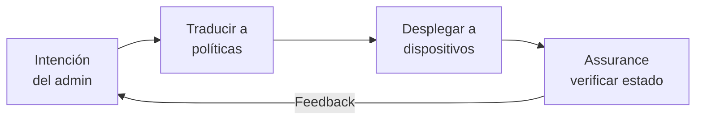
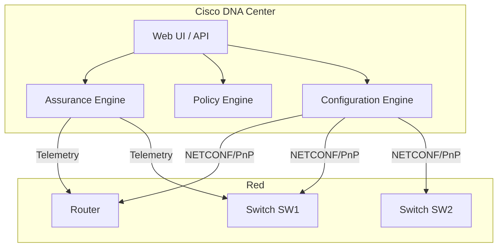
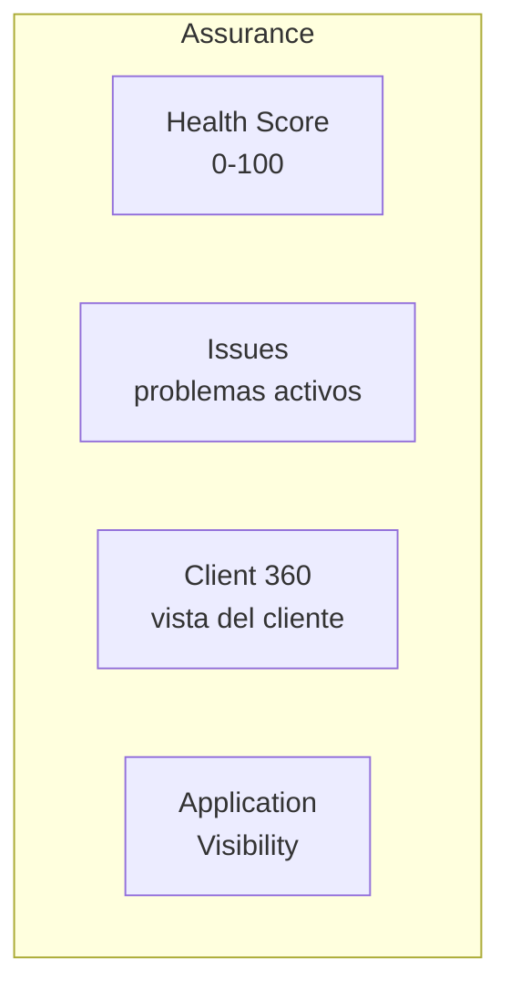
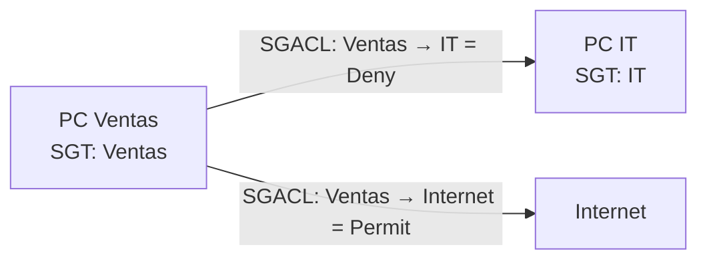
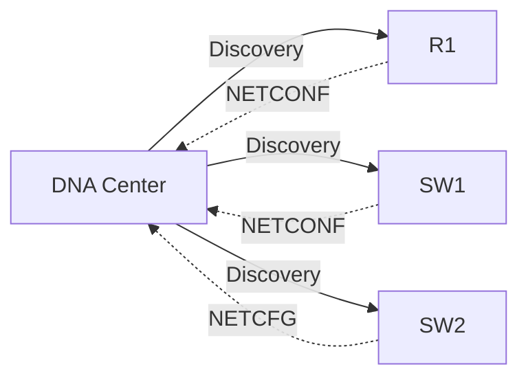
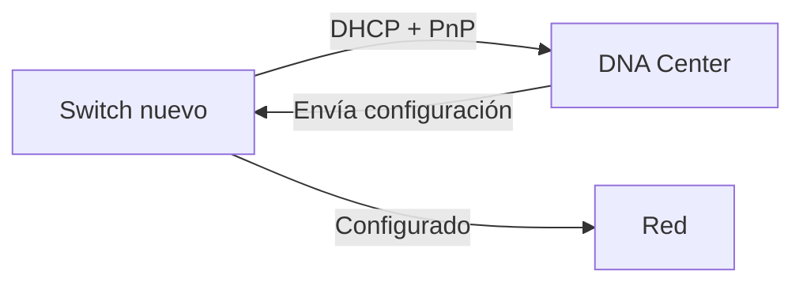

**Intent-Based Networking (IBN)** es un enfoque donde el administrador define
**qué quiere** (intención) y la plataforma se encarga de **cómo lograrlo**.
Cisco DNA Center es la implementación de IBN para campus y branch.

## Qué es Intent-Based Networking

### Tradicional vs IBN

| Aspecto | Tradicional | IBN |
| :------ | :---------- | :-- |
| Configuración | CLI manual | Declarativa (intención) |
| Cambios | Dispositivo por dispositivo | Global, automático |
| Visibilidad | `show` manual | Dashboard centralizado |
| Seguridad | Reglas por IP | Seguridad por identidad |
| Corrección | Manual | Automática (assurance) |

### Ciclo de IBN



1. **Translate**: la plataforma traduce la intención en configuración
   específica para cada dispositivo.
2. **Deploy**: envía la configuración automáticamente.
3. **Assure**: monitorea que la red cumple la intención.
4. **Feedback**: si hay desviación, sugiere o ejecuta correcciones.

## Cisco DNA Center

Cisco DNA Center (DNAC) es la plataforma centralizada de Cisco para
**automatización, visibilidad y seguridad** en redes de campus y branch.

### Arquitectura



### Pilares de Cisco DNA Center

#### 1. Assurance (Visibilidad)

Monitorea la red en tiempo real y reporta el **estado de salud** de cada
dispositivo, enlace y aplicación.

| Métrica | Qué mide |
| :------ | :------- |
| Health Score | 0–100 por dispositivo, interfaz, cliente |
| Issue | Problemas detectados (CPU alta, drops, latency) |
| Client 360 | Vista completa de un cliente (conexión, ubicación, apps) |
| Application Visibility | Qué apps se están usando y su rendimiento |



#### 2. Enforce (Políticas de seguridad)

Define **quién puede comunicarse con quién**, basado en identidad (no en IP).

| Concepto | Descripción |
| :------- | :---------- |
| **SGT** (Security Group Tag) | Etiqueta de seguridad asignada al endpoint |
| **SGACL** | ACL basada en SGT (no en IP) |
| **TrustSec** | Framework de seguridad por identidad |
| **pxGrid** | Intercambio de contexto con ISE |



#### 3. Application Policy (Políticas de aplicación)

Define qué **aplicaciones** necesitan qué **calidad de servicio** y
**seguridad**.

| Concepto | Descripción |
| :------- | :---------- |
| **Application Set** | Grupo de aplicaciones (ej: VoIP, Video) |
| **App Policy** | QoS + seguridad para un grupo de apps |
| **VLAN** | Segmentación tradicional |
| **VN (Virtual Network)** | Segmentación virtual (equivalente a VRF) |

### Flujo de trabajo en DNA Center

#### 1. Descubrir la red



- DNA Center descubre dispositivos vía **CDP/LLDP**.
- Se conecta por **NETCONF** para configurar y monitorear.

#### 2. Day-0: Provisioning (PnP)

**Plug and Play (PnP)**: dispositivos nuevos se configuran automáticamente
al conectarse a la red.



#### 3. Day-1: Configuración

DNA Center aplica configuraciones **globales** con un clic:

- Crear VLANs en todos los switches.
- Configurar QoS en los routers.
- Aplicar ACLs de seguridad.

#### 4. Day-2: Assurance y operación

Monitoreo continuo: health scores, issues, cliente 360.

### DNA Center como plataforma API

DNA Center expone una **API REST completa** para automatización externa:

```bash
# Obtener token
curl -k -X POST https://dnac.local/api/system/v1/auth/token \
  -u admin:password

# Listar dispositivos
curl -k -X GET https://dnac.local/api/v1/network-device \
  -H "X-Auth-Token: $TOKEN"

# Obtener health de dispositivos
curl -k -X GET https://dnac.local/api/v1/device-health \
  -H "X-Auth-Token: $TOKEN"

# Configurar VLAN global
curl -k -X POST https://dnac.local/api/v1/network-settings/network \
  -H "X-Auth-Token: $TOKEN" \
  -H "Content-Type: application/json" \
  -d '{"vlanName":"IT","vlanId":"40"}'
```

## Beneficios de IBN/DNA Center

| Beneficio | Descripción |
| :-------- | :---------- |
| Velocidad | Cambios globales en minutos |
| Consistencia | Mismo cambio aplicado a todos los dispositivos |
| Visibilidad | Dashboard con salud de toda la red |
| Seguridad | Políticas por identidad, no por IP |
| Corrección | Assurance detecta y sugiere correcciones |
| API | Integración con herramientas externas |

## Verificación en DNA Center

| Página | Qué muestra |
| :----- | :---------- |
| **Dashboard** | Health general, issues activos |
| **Inventory** | Todos los dispositivos descubiertos |
| **Provision** | Dispositivos listos para configurar |
| **Assurance** | Health scores por dispositivo/cliente/app |
| **Policy** | Políticas de seguridad y QoS |
| **Network Settings** | VLANs, DNS, NTP, SNMP globales |
